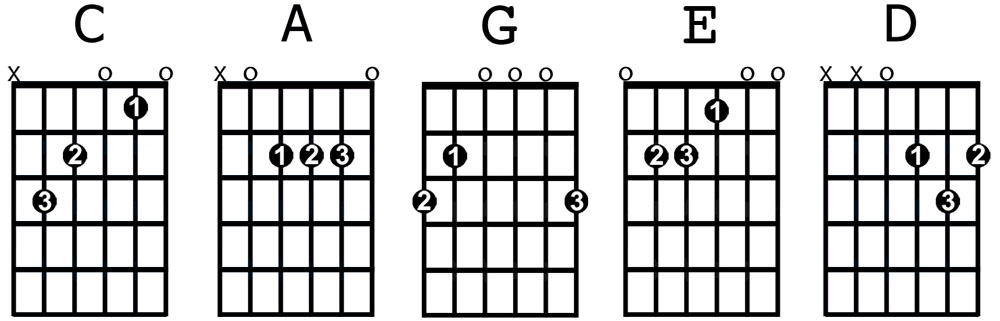

# Deep Learning based Guitar Chord Classification

This repository contains the contend of implementing a vision based guitar chords classification model by utilyzing deep learning. The goal was to train a classifier which can classify between the following five chords:

For the development the CRISP-DM process was used. Overall five iterations were executed:

1. Iteration One - Building a simple chord classifier
2. Iterateon Two - Building a chrod classifier based on cropped images
3. Iteraton Three - Training a object detection SSD on the egohands dataset
4. Iteration Fourt - Training a object detection SSD on a custom guitar hands dataset
5. Iteration Five - Combining the guitar hands detector and chord classifier

## Project Structure
- data/: Contains the data set used for this project. Not present in Github
- models/: Contains the motel weights after for each iteration. 
- utils/: utils code which was used in the notebooks
- vision/: implementation of a Single Shot Detector based on Pytorch. Based on https://github.com/qfgaohao/pytorch-ssd 
- ray_tune/: contains the results of the hyperparameter optimization. Can be visualized by using tensorboard

## Dependencies:
All the required python packages can be found in the requirements.txt. which are:
- numpy 
- pandas
- pytorch 
- torchvision 
- urllib3 
- ray
- imgaug 
- tensorboard 
Can be installed by executing pip install -r requirements.txt

## How to use it:
All the development process during the five iterations is described in the Deep_Learning_Guitar_Chord_Classification.ipynb Notebook. 

If you just want to test the final result. You can simple use the playground.ipynp Notebook which contains some simple snippets to do classififications on static images and on video based on a webcam. 